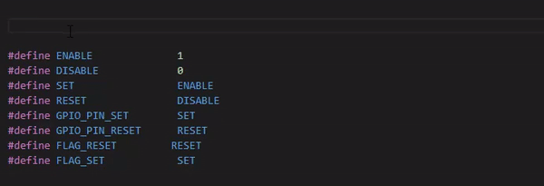
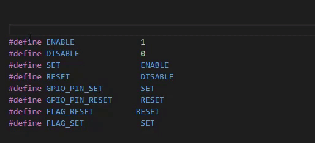
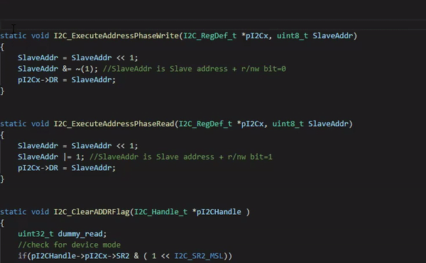
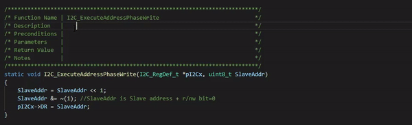

# docgen README

DocGen is a VSCode's extension helping generate comment for C/C++ using shortcut.

## Features

Alt + Z: 
 
- /********** Comment String *********/
- Total length of comment is 60, 80, 100, ... depend on the length of Comment String.

Alt + X: 
 
- /********** Comment String **********/
- Addittional 20 "*", 2 "/" and 2 " " will be added to Comment String/

Alt + C: Generate function description.
 

Alt + V: re-arrange comment line
 

## Requirements

## Extension Settings

## Known Issues

## Release Notes

### 0.0.1

Initial release.

### 0.0.2

- Improve alt + C: auto detect and add function name to Function Name field.
- Add alt + Z.

### 0.0.4
- Update readme.md