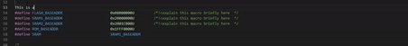

# docgen README

DocGen is a VSCode's extension helping generate comment for C/C++ using shortcut.

## Features

Alt + Z: 
- 
 
- /********** Comment String *********/
- Total length of comment is 60, 80, 100, ... depend on the length of Comment String.

Alt + X: 
- 
 
- /********** Comment String **********/
- Addittional 20 "*", 2 "/" and 2 " " will be added to Comment String/

Alt + C: Generate function description.
- 
 

Alt + V: re-arrange comment line
- 
 

Generate Class
- 
 

Generate Function Definition
- 
 

Generate Header File
- 
 

Generate Source File
- 
 

## Requirements

## Extension Settings

## Known Issues

## Release Notes

### Update Version 1.0